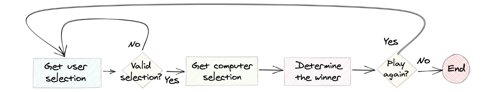

# Game - Rock paper Scissors

## Setup Virtual Environment
- Make sure the python version is 3.6
- `https://www.python.org/downloads/`
- `sh setup.sh`

## Start game
- `python3 game.py`

## What Is Rock Paper Scissors?
We may have played rock paper scissors before. Maybe you’ve used it to decide who pays for dinner or who gets first choice of players for a team.

rock paper scissors is a hand game for two or more players. Participants say “rock, paper, scissors” and then simultaneously form their hands into the shape of a rock (a fist), a piece of paper (palm facing downward), or a pair of scissors (two fingers extended). 
The rules are straightforward:
- `Rock smashes scissors`
- `Paper covers rock`
- `Scissors cut paper`

## Flow Diagram

  

## Project Extensions
- ``
- ``